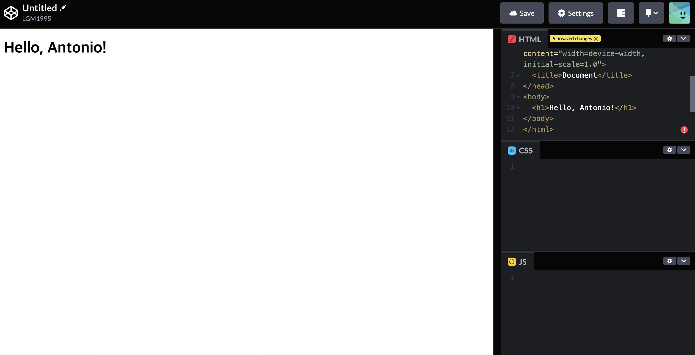
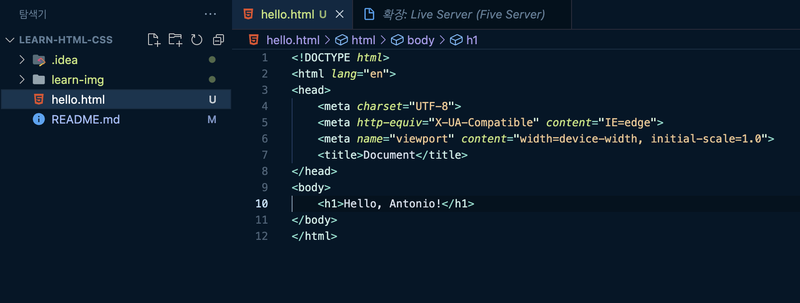
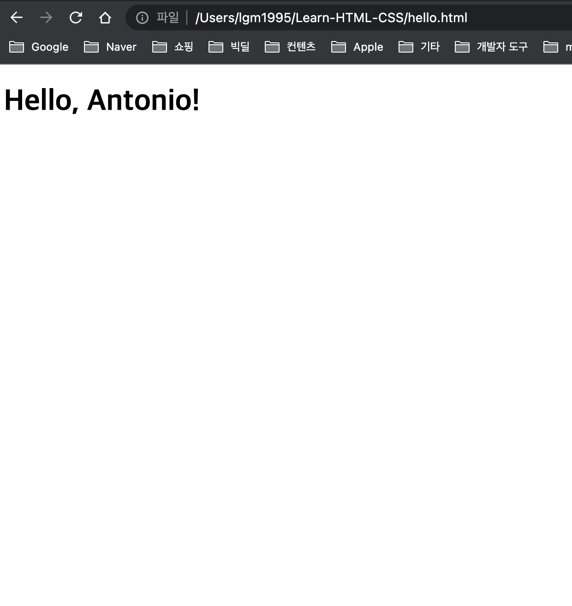
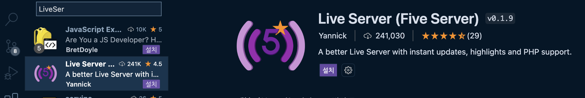
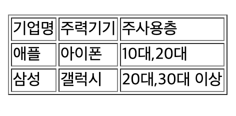
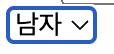
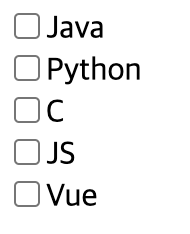
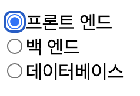
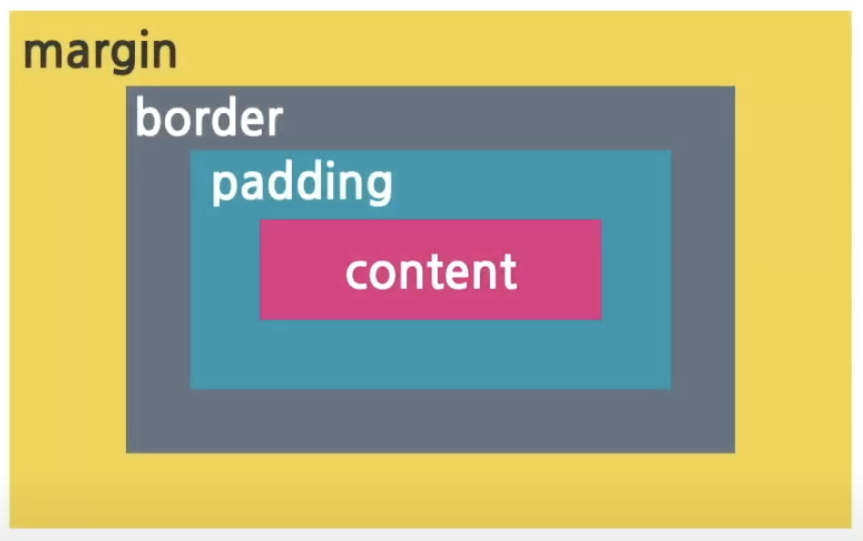
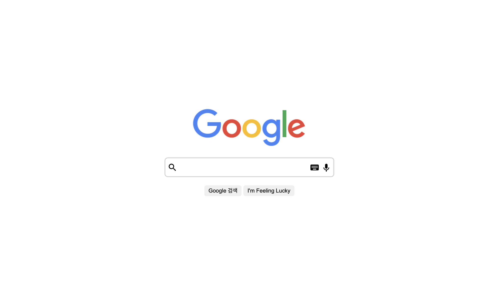

# Learn-HTML-CSS

문서화

* browser: Chrome
* Develop Tools: VScode , CodePen
## Learn 01 Html 과 Css
기본적으로 웹은 Client 와 Server 의 동작으로 이루어 집니다.
이 때 Client는 Server에 request(요청)을 보내고 서버는 요청을 처리하여 Client에 response(응답)을 보냅니다.

이때 Client는 사용자에게 보여지는 영역으로 Front-End 영역이라 하고 Server는 보여지지 않는 영역으로 Back-End 영역이라고 합니다.

Html과 Css는 Front-End영역에 속한 문서의 구조와 디자인을 담당합니다.

## Learn 02 CodePen 사용하기
CodePen을 사용하여 Html, Css, JavaScript를 웹에서 실습할 수 있다.

* CodePen을 사용

* VSCode를 사용하여 hello.html 생성

* 웹 브라우저에서 html파일 열기

* VSCode에서 바로 동작 시키기 위한 라이브러리(Live Server) 설치


## Learn 03 Html 태그 사용하기

* text 태그
  * h (머릿말) 
```
<h1>머릿말 내용</h1>
```
  * p (단락)
```
<p>단락 내용</p>
```
* link 태그
  * a (링크)
```
<a href="이동할 url">표시할 내용</a>
```
* media 태그
  * img (이미지)
```

```
* list 태그
```
<ul>
  <li>리스트 1</li>
  <li>리스트 2</li>
  <li>리스트 3</li>
</ul>
```

* table 태그
```
<table>
  <tr>
    <td>content</td>
    <td>content</td>
  </tr>
  <tr>
    <td>content</td>
    <td>content</td>
  </tr>
</table>
```

* input 태그
```
<input type="타입명"/>

<textarea></textarea>
```

## Learn 04 Html 구조

Html의 큰 골격은 head, body로 나눌 수 있다.
* head: html의 정보를 담는 영역 (눈에 보이지 않는 문서의 다양한 정보)

* body: 문서의 내용을 담는 영역 (눈에 보이는 문서에 표시할 모든 내용)

## Learn 05 link 이동

a 태그를 활용하여 페이지 이동이 가능하다

* 기존 페이지에서 새로운 페이지 이동
```
<a href="이동할 페이지 url">화면에 표시될 내용</a>
```
* 새로운 창에서 페이지 이동
```
<a href="이동할 페이지 url" target="_blank">화면에 표시될 내용</a>
```

## Learn 06 List

리스트는 순서가 있는 리스트와 순서가 없는 리스트로 구분된다.

* 순서가 없는 리스트 (Unorderd List)
```
<ul>
  <li>item1</li>
  <li>item2</li>
  <li>item3</li>
</ul>
```

* 순서가 있는 리스트 (Ordered List)
```
<ol>
  <li>item1</li>
  <li>item2</li>
  <li>item3</li>
</ol>
```

## Learn 07 Table

테이블은 헤드와 바디로 구성되어 있으며 각 tr(table row)에 td(table data)들로 이루어진다.

```
<table border="1">
  <thead>
    <tr>
      <td>기업명</td>
      <td>주력기기</td>
      <td>주사용층</td>
    </tr>
  </thead>
  <tbody>
    <tr>
      <td>애플</td>
      <td>아이폰</td>
      <td>10대,20대</td>
    </tr>
    <tr>
      <td>삼성</td>
      <td>갤럭시</td>
      <td>20대,30대 이상</td>
    </tr>
  </tbody>
  </table>
```

* 실제 화면에서 모습




## Learn 08 Input

Input은 클라이언트로 부터 데이터를 입력 받을 때 사용하는 태그로 데이터 정보에 따라 여러가지 방법을 사용할 수 있다.

* input
```
<input type="text"> // 텍스트를 입력하는 폼
<input type="date"> // 날짜를 입력하는 폼
```

* select
```
<select> // 옵션들 중 선택이 가능한 폼
  <option>남자</option>
  <option>여자</option>
</select>
```


* textarea
```
<textarea></textarea> // 대량의 텍스트를 입력 받을 때
```

* checkbox (다중 선택이 있을 경우 주로 사용)
```
<div><input type="checkbox" /><label>Java</label></div>
<div><input type="checkbox"/><label>Python</label></div>
<div><input type="checkbox"/><label>C</label></div>
<div><input type="checkbox"/><label>JS</label></div>
<div><input type="checkbox"/><label>Vue</label></div>
```


* radio (name에 같은 값을 주면 다중 선택 불가)
```
<div><input type="radio" name="team"/><label>프론트 엔드</label></div>
<div><input type="radio" name="team"/><label>백 엔드</label></div>
<div><input type="radio" name="team"/><label>데이터베이스</label></div>
```


## Learn 09 Css

css는 HTML구조에 옷을 입히는 것과 같다. style 코드를 통하여 변경이 가능하며
코드의 지저분함을 없애기 위해 css파일을 만들어 html의 head에서 link를 사용하는 것이 좋다.
```
<link rel="stylesheet" href="test.css">
```
대상을 가르키기 위해 셀렉터를 사용하며 셀렉터는 태그, 클래스, 아이디 셀렉터가 있다.
```
css파일의 주석은 /* */를 사용한다.
.male { color: #007bff; } /* class 셀렉터는 .이다 */

.female { color: #e43681; }

ul { list-style: none; } /* 태그 셀렉터는 태그 자체를 입력하면 된다 */

#ceo { background-color: #dfe0e1; } /* id 선택자는 #이다 */
```

## Learn 10 Selector

셀렉터는 기본적으로 태그, 아이디, 클래스 선택이 가능하며 범위로 구분하여 전체 선택, 내부선택, 동시선택 또한 가능하다.

* 전체 선택
```
* {
변경할 스타일
}
```

* 내부 선택
```
A B { /* A 밑에 B를 선택 */
변경할 스타일
}
```

* 동시 선택
```
CD { /* C와 D를 동시 선택 */ 
변경할 스타일
}
```

## Learn 11 Box Model



* content: 내용물을 담는 곳으로 width와 height로 크기를 정할 수 있다.


* padding: content를 포장하는 역할


* border: padding의 경계

* margin: border 밖의 여백

## Learn 12 블럭과 인라인

box로 감싸는 모델은 주로 블럭과 인라인이 있는데 둘은 차이점이 있다.

* 블럭
```
1. 주로 <div> 태그를 사용하며 한 라인에 한개씩 쌓인다.
2. 가로와 세로 길이를 가진다.
3. 주로 화면 배치를 위해 사용한다.
```

* 인라인
```
1. 주로 <span>태그를 사용하며 한 줄에 여러 요소를 가진다.
2. 크기를 직접 정할 수 없으며, 내용물의 크기에 따라 결정된다.
3. 주로 text를 꾸밀 때, 사용한다.
```

## Learn 13 CSS Position

CSS Position은 요소 배치를 위한 속성으로 5가지가 있다.

* static: 기본 값(디폴트)
* relative: 기본 위치를 기준으로 이동(이동값을 줘야함)
* absolute: 부모(position: relative;)를 기준으로 절대 위치로 이동
* fixed: 화면을 기준으로 절대 위치로 이동
* sticky: 스크롤 시 화면에서 사라지지 않고 들러 붙게함
 
## Learn 14 Position 예제

* html
```
<!DOCTYPE html>
<html lang="en">
  <head>
    <meta charset="UTF-8" />
    <meta name="viewport" content="width=device-width, initial-scale=1.0" />
    <title>구글</title>
    <!-- 구글 머테리얼 아이콘 -->
    <link
      href="https://fonts.googleapis.com/icon?family=Material+Icons"
      rel="stylesheet"
    />

    <!-- css 연결 -->
    <link rel="stylesheet" href="style.css" />
  </head>
  <body>
    <div class="fixed-container">
      <div class="logo">
        
      </div>
      <div class="inputs">
        <span class="material-icons">search</span>
        <input type="text" />
        <span class="material-icons">keyboard</span>
        <span class="material-icons">keyboard_voice</span>
      </div>
      <div class="buttons">
        <button>Google 검색</button>
        <button>I'm Feeling Lucky</button>
      </div>
  </div>
  </body>
</html>
```

* CSS
```
.fixed-container {
  width: 80%;

  position: fixed;
  top: 50%;
  left: 50%;

  /* 이동 */
  transform: translate(-50%, -50%);
  /* 가운데 정렬 */
  text-align: center;
}

.logo,
.inputs {
  margin-bottom: 20px;
}

.inputs {
  border: 2px solid lightgray;
  display: inline-block;
  padding: 5px;
  border-radius: 8px;
}

.inputs .material-icons {
  position: relative;
  top: 5px;
}

.inputs input {
  font-size: 20px;
  padding: 5px;
  border: none;
  width: 300px;
  outline: none;
}

.buttons button {
  border-radius: 5px;
  padding: 5px 10px;
  border: none;
}
```
* 화면


## Learn 15 Flex

Flex 는 정렬을 위한 Container이다.

주로 div 안에 item들을 정렬 하기 위해 사용된다.
